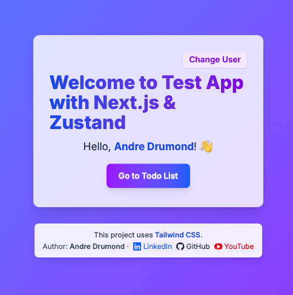

# 🚀 Test App with Next.js, Zustand & Tailwind

Welcome to the **Test App**! This is a beautiful, modern Todo List built with Next.js, Zustand, and Tailwind CSS, fully integrated with a robust backend API.

---

## ✨ Features

- Next.js 15 (App Router, SSR, TypeScript)
- Zustand for global state management
- Tailwind CSS for modern, responsive UI
- Axios for API requests
- Modular, scalable folder structure
- Pagination, filtering, CRUD, and soft delete
- Beautiful UI/UX with accessibility in mind

---

## 📦 Stack

- **Frontend:**
  - [Next.js](https://nextjs.org/) (TypeScript, App Router)
  - [Zustand](https://zustand-demo.pmnd.rs/)
  - [Tailwind CSS](https://tailwindcss.com/)
  - [Axios](https://axios-http.com/)
- **Backend:**
  - [NestJS](https://nestjs.com/) + [Mongoose](https://mongoosejs.com/) + Clean Architecture
  - OData v4 query support

---

## ⚡️ Live Demo

> _Coming soon!_

---

## 🛠️ Getting Started

### 1. Clone and Run the Backend

You **must** have the backend running locally for this app to work:

```bash
git clone https://github.com/andredrumond1995/nestjs-mongoose-clean-arch.git
cd nestjs-mongoose-clean-arch
docker-compose up --build
```

The API will be available at: `http://localhost:3000/v1/todos`

### 2. Clone and Run the Frontend

```bash
git clone <este-repositorio>
cd <este-repositorio>
npm install
npm run dev
```

Acesse: [http://localhost:3000](http://localhost:3000)

---

## 📋 Requirements

- Node.js 18+
- Docker (for backend)

---

## 📚 API Reference

Acesse a documentação do backend para detalhes dos endpoints: [nestjs-mongoose-clean-arch](https://github.com/andredrumond1995/nestjs-mongoose-clean-arch)

Principais endpoints:
- `GET /v1/todos` — List todos (OData v4: `$filter`, `$top`, `$skip`, etc)
- `POST /v1/todos` — Create todo
- `PUT /v1/todos/:id` — Update todo
- `DELETE /v1/todos/:id` — Soft delete todo

---

## 👤 Author

**Andre Drumond**

- [LinkedIn](https://www.linkedin.com/in/andre-drumond/)
- [GitHub](https://github.com/andredrumond1995)
- [YouTube](https://www.youtube.com/@drumonddev)

---

## 🖌️ Screenshots



> Tela inicial do Test App com Next.js, Zustand e Tailwind CSS.

---

## 📄 License

MIT
